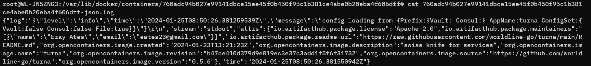

# Log Solutions

Testing logging solutions for microservices.

## Swarm + Loki + Promtail

Before to start configure the docker log driver:

```sh
cat /etc/docker/daemon.json
{
    "log-driver": "json-file",
    "log-opts": {
        "labels-regex": "^.+",
        "max-size": "10m",
        "max-file": "3"
    }
}
```

`labels-regex` is used to add extra information in the log.



Env is `deploy_1`, run the environment:

```sh
PROJECT_NAME=log make env
PROJECT_NAME=services make env
```

Send some logs:

```sh
curl -X POST -d '{"message": "hello world"}' http://localhost:8080
```

Deploy to swarm:

```sh
docker swarm init

PROJECT_NAME=log make env-swarm
PROJECT_NAME=services make env-swarm
```
